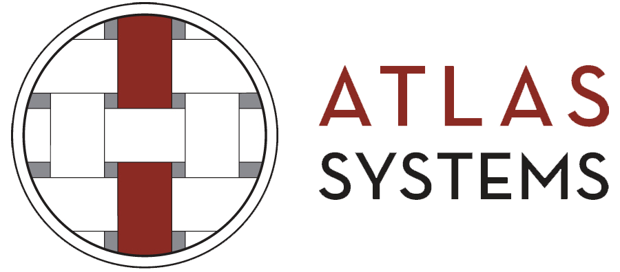
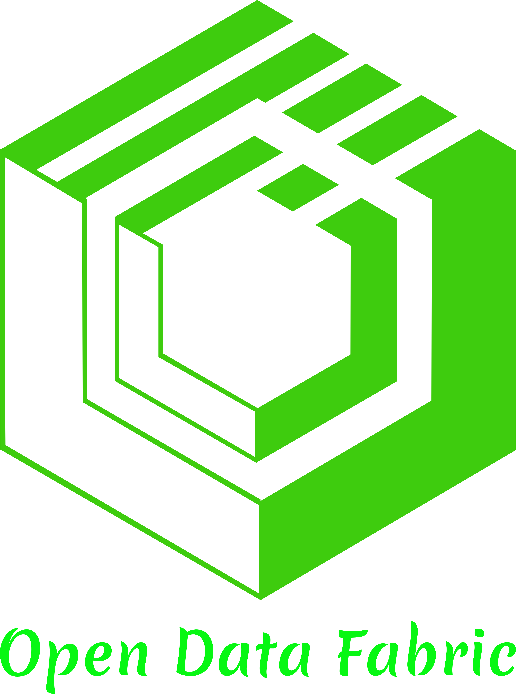
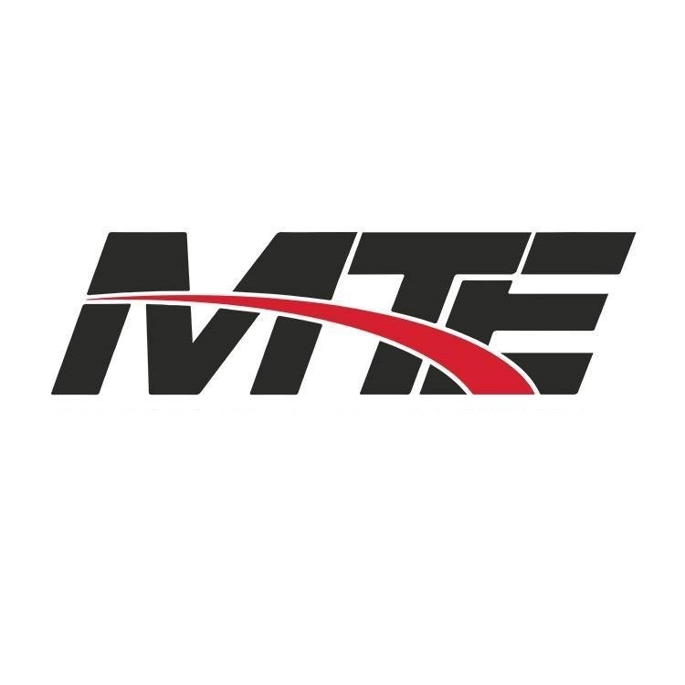
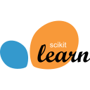
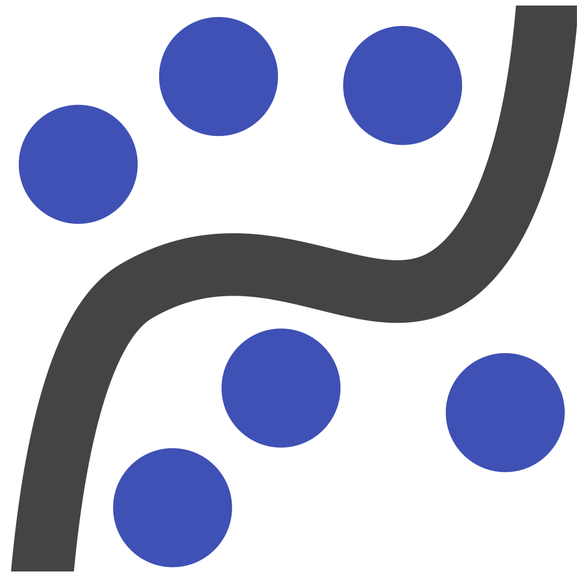
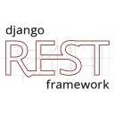
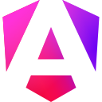
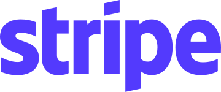

# SRINIVAS DHARAVATH
## Senior AI Engineer | Generative AI | Agentic AI | LLM Engineering

> **I build intelligent AI systems, teach AI/ML engineering, and build products that make AI useful in the real world.**

Senior AI Engineer focused on building production-grade **Generative AI, Agentic AI, LLM, RAG, and cloud-native systems**.

My engineering journey spans backend development, AWS architecture, AI/ML engineering, LLM fine-tuning, multimodal AI, agentic workflows, and production AI products.

---

# 01 — ABOUT ME

I am a Senior AI Engineer with hands-on experience designing and deploying intelligent systems across **Healthcare, TPRM, LegalTech, FinTech, FMCG, and Recruitment Consulting**.

My work sits at the intersection of:

- Generative AI
- Agentic AI
- LLM Engineering
- RAG
- Multimodal AI
- LLM Fine-tuning
- Backend Engineering
- Cloud Architecture
- MLOps / DevOps
- AI Product Engineering

I enjoy taking AI systems beyond prototypes and turning them into **reliable, scalable, observable production applications**.

I work across the **full delivery lifecycle** — requirements gathering, prototyping, architecture (HLD & LLD), database design, backend and frontend development, deployment setup, go-live, AI performance monitoring, and load balancing.

My career progression has moved from:

**Backend & Cloud → AI/ML → LLM Engineering → Agentic AI → Production AI Products → AI Education & AI Entrepreneurship**

---

# 02 — WHAT I BUILD

### Generative AI Systems
LLM-powered applications that understand documents, conversations, business context, and user intent.

### Agentic AI
Multi-agent systems that plan, reason, retrieve information, execute tools, validate outputs, and automate workflows.

### RAG Systems
Enterprise retrieval systems combining advanced chunking, embeddings, multimodal data processing, intelligent routing, and agentic reasoning.

### Conversational AI
Real-time voice and text agents with streaming, structured outputs, memory, personalization, interruption handling, and model failover.

### Multimodal AI
Systems capable of working with PDFs, spreadsheets, images, audio, video, handwritten content, and structured data.

### AI Infrastructure
Production architecture covering APIs, containers, cloud services, observability, cost tracking, authentication, storage, queues, and deployment automation.

---

# 03 — HOW I DELIVER: END-TO-END AI DELIVERY LIFECYCLE

I am part of the **full development lifecycle** — from the first requirements conversation to a monitored, load-balanced production system.

```text
Requirements Gathering
        │
        ▼
Prototyping
        │
        ▼
Architecture — HLD & LLD
(integrations + AI agents)
        │
        ▼
Database Design
        │
        ▼
Backend + Frontend Development
        │
        ▼
Deployment Setup (CI/CD)
        │
        ▼
Go-Live
        │
        ▼
Monitoring AI System Performance
        │
        ▼
Load Balancing & Scaling
```

| Stage | What I Do |
|---|---|
| **1. Requirements Gathering** | Understand the business problem, users, workflows, and success criteria. |
| **2. Prototyping** | Build prototypes to validate the AI approach, model choice, and user flow before committing to production. |
| **3. Architecture (HLD & LLD)** | Design high-level and low-level architecture covering system components, third-party integrations, AI agents, and data flow. |
| **4. Database Design** | Design data models across relational (SQL / PostgreSQL on Amazon RDS and Supabase), NoSQL (MongoDB), and vector databases (FAISS, ChromaDB). |
| **5. Backend + Frontend Development** | Build the APIs and AI/agent services (Django, FastAPI), and the user-facing application (React, Next.js, Angular). |
| **6. Deployment Setup** | Set up CI/CD pipelines, containers, and cloud infrastructure on AWS and Azure. |
| **7. Go-Live** | Take the system to production and support the release. |
| **8. Monitoring** | Monitor AI system performance — latency, token usage, cost, errors, and logs. |
| **9. Load Balancing** | Distribute traffic and scale services to handle production load. |

---

# 04 — CURRENT PRODUCT WORK — BRIDGETOWN CONSULTING GROUP

**Senior AI Engineer — Bridgetown Consulting Group**

Bridgetown Consulting Group is a **US recruitment consulting firm**, with four further business units in India — **6com, Techsquare, Hexagon and Archer**.

I build products on both sides of the business: a consumer healthcare product for the US market, and the internal platforms the group runs on.

---

## PTBuddy — Physiotherapy App with the Anya AI Assistant

PTBuddy helps people in the US market manage physiotherapy needs **before, and between, direct consultations with a doctor**.

**Status:** built and in testing with doctors, ahead of a public launch.

Physiotherapists upload exercise videos for different pain types. A user onboards by answering questions about their pain level, pain area and daily habits, and the app builds a weekly exercise program from those answers. Each week the user records how their pain has changed, and the next set of exercises is re-ranked from the updated picture.

Inside the app, **Anya** is an AI assistant that already holds the user's own context, so users can ask for tips and guidance without repeating their history. A social feed lets users connect with others on the app and share their progress.

### How the product works

```text
Physiotherapist uploads exercise videos
                │
                ▼
      User onboarding questionnaire
   (pain level · pain area · daily habits)
                │
                ▼
     Personalized weekly exercise program
                │
                ▼
          User performs exercises
                │
                ▼
      Weekly pain and progress check-in
                │
                ▼
      Next week's program re-ranked
                │
                ├───────────────► Anya AI assistant
                │                 (user-level context,
                │                  tips, guardrails)
                ▼
      Social feed — achievements, community
```

### Anya — the in-app AI assistant

Anya is a stateful LLM agent with access to the user's questionnaire, pain history, program and progress.

**Guardrails come first.** Anya does not hand out remedies for serious symptoms. When a conversation points to something beyond self-managed physiotherapy, it tells the user to consult a doctor instead of suggesting a fix.

### Core Architecture

```text
                    ┌─────────────────────┐
                    │       User          │
                    │   PTBuddy app       │
                    └──────────┬──────────┘
                               │
                               ▼
                    ┌─────────────────────┐
                    │ Conversational API  │
                    └──────────┬──────────┘
                               │
                               ▼
                    ┌─────────────────────┐
                    │     LangGraph       │
                    │  Stateful AI Agent  │
                    └──────────┬──────────┘
                               │
                 ┌─────────────┼─────────────┐
                 ▼             ▼             ▼
        ┌──────────────┐ ┌────────────┐ ┌──────────────┐
        │ Gemini 2.5   │ │ Conversation│ │ Personaliza- │
        │ Flash        │ │ Memory      │ │ tion Engine  │
        └──────────────┘ └────────────┘ └──────────────┘
                               │
                               ▼
                    ┌─────────────────────┐
                    │ Structured JSON     │
                    │ Response Contract   │
                    └──────────┬──────────┘
                               │
                               ▼
                    ┌─────────────────────┐
                    │ SSE Token Streaming │
                    └─────────────────────┘
```

### Key Engineering Features

- LangGraph-based conversational agent
- Google Gemini 2.5 Flash
- Stateful graph checkpointing
- Rolling conversation summarization
- Bounded-token memory strategy
- Strict structured-JSON output contract
- Context-aware follow-up chips
- Server-Sent Events token streaming
- Multi-model retry and failover
- Clinical guardrails and escalation to a doctor
- AI-driven exercise program personalization
- Ranking of exercise programs using questionnaire, pain history and medical context
- Deterministic keyword-scoring fallback for resilience

### AWS Architecture

```text
                    ┌─────────────────────┐
                    │     Frontend        │
                    └──────────┬──────────┘
                               │
                 ┌─────────────┼─────────────┐
                 ▼             ▼             ▼
              CloudFront      S3           API
                 │             │             │
                 │             │             ▼
                 │             │       AI Application
                 │             │             │
                 │             │       ┌─────┴─────┐
                 │             │       ▼           ▼
                 │             │   PostgreSQL    LLM APIs
                 │             │       │
                 │             │       ▼
                 │             │   RDS
                 │
                 ▼
             HLS Video

     SES → Transactional Email
     SMTP → Email Fallback
     Stripe → Subscription & Webhooks
     FCM → Push Notifications
     CloudWatch → Structured Logging
```

### Infrastructure

- Amazon S3 private/public buckets
- Presigned URL browser uploads
- Amazon SES transactional email
- SMTP email fallback
- Amazon CloudFront
- HLS exercise video delivery
- Amazon RDS PostgreSQL
- Stripe subscriptions and webhooks
- Firebase Cloud Messaging
- CloudWatch structured logging

### Observability

Built full LLM cost observability covering:

- Token usage per LLM call
- Latency per call
- Cost tracking
- Structured application logging
- CloudWatch monitoring

---

## Internal HRMS — Five Business Units, One Administrator

A custom HR management system for Bridgetown and its four India business units, live across the group.

**600 employees** use it. Each business unit has its own roles and permissions, and **no data crosses between units**. A single administrator at Bridgetown oversees the whole group: attendance, leave and all administration operations.

**My role:** design, prototype, database, backend and deployment. The frontend was built by another team.

```text
                 Bridgetown (US)
              single group administrator
                        │
     ┌──────────┬───────┴────┬──────────┬──────────┐
     ▼          ▼            ▼          ▼          ▼
   Business   Business    Business   Business   Business
    unit 1     unit 2      unit 3     unit 4     unit 5
     │          │            │          │          │
   roles      roles        roles      roles      roles
        (RBAC per business unit — no cross-unit access)
                        │
                        ▼
     Attendance · Leave · Employee administration
                        │
             ┌──────────┴──────────┐
             ▼                     ▼
      AI-assisted leave      AI attendance
        application             reports
```

### Key Engineering Areas

- 600 employees across five business units
- Role-based access control, scoped per business unit
- Strict data isolation between business units
- Single group-level administrator view
- Attendance management
- Leave management with AI-assisted applications
- AI-generated attendance reporting
- Employee administration workflows

---

## AI-Enabled ATS — Recruitment, End to End

An applicant tracking system for the recruitment business, live and covering the full lifecycle and the several teams that work along it.

**60 people across the recruitment teams** work in the same system, with **200 candidates** tracked through it.

**My role:** design, prototype, database, backend and deployment. The frontend was built by another team.

```text
   Client onboarding        Vendor onboarding
            │                       │
            └───────────┬───────────┘
                        ▼
                  Job requirements
                        │
                        ▼
              Candidate onboarding
                        │
                        ▼
              Document collection
                        │
                        ▼
            AI resume screening and matching
                        │
                        ▼
            Application submitted to the job
                        │
                        ▼
              Interview scheduling
                        │
                        ▼
          Candidate onboarded to the job
```

### Key Engineering Areas

- Client and vendor onboarding, so requirements reach the recruitment teams
- Candidate onboarding and document collection
- AI resume screening against job requirements
- Application submission and tracking
- Interview scheduling
- Candidate onboarding to the job
- Multi-team workflows in one system: 60 people, 200 candidates tracked

---

# 05 — ADDITIONAL CURRENT WORK

Alongside my primary Senior AI Engineer role, I am also actively involved in **AI education, AI product engineering, and startup building**.

These experiences extend my work beyond individual engineering projects into teaching, product development, and building AI-native businesses.

---

## AI/ML Engineering Teaching Assistant
### Masai School

I work as a **Teaching Assistant for the AI/ML Engineering course at Masai School**, supporting a learning community of **800+ students**.

### Responsibilities

- Conduct tutorial sessions for the AI/ML Engineering course.
- Explain technical concepts and smaller supporting concepts from the curriculum.
- Help students understand difficult topics through practical explanations.
- Address student doubts during and around tutorial sessions.
- Break down complex AI/ML concepts into simpler, approachable explanations.
- Support students as they work through their AI/ML learning journey.

### Why It Matters

Teaching AI/ML at scale has strengthened my ability to communicate technical concepts clearly, identify where learners get stuck, and explain engineering ideas from first principles.

**Role:** AI/ML Engineering Teaching Assistant  
**Scale:** 800+ students  
**Focus:** Tutorials · Doubt Resolution · AI/ML Concepts · Technical Mentoring

---

## AI Engineer (Consultant)
### Walker Sands, through Balihans

**Client Engagement: Walker Sands**

Consulting for Walker Sands through Balihans on enterprise agentic systems and workflow automation, including an enterprise knowledge platform built around internal documents and Google Drive repositories.

### Enterprise Multi-Agent RAG Platform

The platform was designed for multiple departments, with each department having its own administrator and knowledge repository.

```text
                         WALKER SANDS
                              │
             ┌────────────────┼────────────────┐
             │                │                │
          Finance           Tech           Marketing
             │                │                │
             └────────────────┼────────────────┘
                              │
                        Department Admin
                              │
                              ▼
                     Connect Google Drive
                              │
                              ▼
                  Department Knowledge Base
                              │
             ┌────────────────┼────────────────┐
             ▼                ▼                ▼
        Team Member      Team Member      Team Member
             │                │                │
       Create Folder     Create Folder     Create Folder
             │                │                │
             └────────────────┼────────────────┘
                              ▼
                     Select Documents
                              │
                              ▼
                      Conversational RAG
                              │
                              ▼
                     Agentic Retrieval
                              │
                              ▼
                     Contextual Answer
```

### Key User Workflow

- Department administrators connect their Google Drive repository.
- Team members create and organize their own folders.
- Users select documents or folders as conversation context.
- Users chat with the selected documents through the RAG system.
- Agentic retrieval workflows provide contextual answers.

### Key Engineering Areas

- Google Drive integration
- Department-level knowledge organization
- Admin-controlled repository connections
- User-created document folders
- Document and folder selection
- Context-aware retrieval
- Enterprise RAG
- Multi-agent workflows
- Conversational document intelligence
- PostgreSQL database hosted on Supabase
- Scalable cloud-native architecture

> **Engagement:** Balihans  
> **Client:** Walker Sands  
> **Focus:** Enterprise RAG · Google Drive · Multi-Agent AI · Document Intelligence · PostgreSQL (Supabase)

---

## AI Engineer (Consultant)
### ShaktyAI

urlShaktyAIhttps://www.shakty.ai/

I work with ShaktyAI on building intelligent AI systems focused on personalized, useful AI assistance.

My engineering work includes building **RAG-based agents and multi-agent systems** using modern agentic AI frameworks.

### Key Work

- RAG-based AI agents
- Multi-agent systems
- Agent orchestration using CrewAI
- Agent development using Agno
- Retrieval-augmented generation workflows
- Tool-enabled AI agents
- Context-aware reasoning workflows
- Intelligent task execution

### Agentic Architecture

```text
                    User
                     │
                     ▼
             ┌───────────────┐
             │ AI Application│
             └───────┬───────┘
                     │
                     ▼
             ┌───────────────┐
             │ Agent Router  │
             └───────┬───────┘
                     │
              ┌──────┴──────┐
              ▼             ▼
        RAG Agent       Multi-Agent
                           System
                              │
                 ┌────────────┼────────────┐
                 ▼            ▼            ▼
              Agent 1      Agent 2      Agent 3
                 │            │            │
                 └────────────┼────────────┘
                              ▼
                        Tools / Retrieval
                              │
                              ▼
                         Final Response
```

### Technology

`RAG` · `CrewAI` · `Agno` · `LLMs` · `Agentic AI` · `Retrieval` · `Tool Calling`

---

## Co-Founder
### MentionNow

I am a **Co-Founder of MentionNow**, an AI visibility platform currently at the **MVP stage**.

MentionNow helps brands — whether personal brands, organizations, or companies across industries — understand and improve how they appear across AI-powered answer engines and LLMs such as:

- ChatGPT
- Claude
- Perplexity
- Other generative AI platforms

### The Problem

Traditional SEO focuses heavily on visibility in search engines.

The next layer of digital visibility is **visibility inside AI-generated answers**.

A brand may have a strong web presence but still be poorly represented, mentioned, or recommended by AI systems.

MentionNow is being built to measure and improve this emerging form of visibility.

### What MentionNow Does

```text
                 Brand / Organization
                          │
                          ▼
                ┌──────────────────┐
                │ MentionNow       │
                │ AI Visibility    │
                │ Engine           │
                └────────┬─────────┘
                         │
             ┌───────────┼───────────┐
             ▼           ▼           ▼
         AI Queries   Visibility   Competitor
                      Analysis     Comparison
             │           │           │
             └───────────┼───────────┘
                         ▼
                AI Visibility Score
                         │
                         ▼
                Improvement Tasks
                         │
                         ▼
                Continuous Tracking
```

### Core Product Capabilities

- Tracks brand visibility across LLM-powered platforms.
- Analyzes how and where a brand appears in AI-generated answers.
- Measures AI visibility through a dedicated visibility score.
- Identifies gaps and opportunities to improve visibility.
- Generates actionable tasks to improve AI visibility.
- Continuously tracks changes over time.
- Helps organizations build stronger representation in the generative AI ecosystem.

### Product Positioning

**MentionNow is a Generative Engine Optimization (GEO) platform.**

The goal is to help organizations move from:

**“Can people find my brand on the web?”**

to:

**“Does AI know, understand, mention, and recommend my brand?”**

### Current Stage

- MVP stage
- Early client validation
- Free access provided to selected organizations
- Clients include urlIntellectyxhttps://www.intellectyx.com/ and other firms in the US and Malaysia

### Product Focus

`Generative Engine Optimization` · `AI Visibility` · `LLM Analytics` · `Brand Intelligence` · `Generative AI`

---

# 06 — FEATURED PROJECTS

## Project 02 — Multi-Agent TPRM Automation

### Problem

Third-Party Risk Management requires multiple stages of assessment, document analysis, validation, risk identification, control mapping, and compliance verification.

### Solution

Built a multi-agent TPRM system that automates the end-to-end workflow.

### Automated Workflow

```text
Vendor Information
       │
       ▼
┌────────────────────┐
│ Inherent Assessment│
└─────────┬──────────┘
          ▼
┌────────────────────┐
│ Risk Identification│
└─────────┬──────────┘
          ▼
┌────────────────────┐
│ Control Mapping    │
└─────────┬──────────┘
          ▼
┌────────────────────┐
│ Vendor Response    │
│ Validation         │
└─────────┬──────────┘
          ▼
┌────────────────────┐
│ Residual Assessment│
└─────────┬──────────┘
          ▼
┌────────────────────┐
│ Compliance         │
│ Validation         │
└────────────────────┘
```

### Agentic Stack

- CrewAI
- FileReadTool
- FirecrawlSearchTool
- ScrapeWebsiteTool
- RagTool
- Agent-based risk reasoning
- Automated control mapping
- Compliance validation

### Engineering Focus

Designed a scalable QA agent framework to improve reliability, risk mitigation, and regulatory adherence.

---

# 07 — ENTERPRISE MULTI-AGENT RAG PLATFORM

## Project 03 — Enterprise Multi-Agent RAG

Built an enterprise-grade multimodal RAG platform capable of processing **10+ file formats**, including:

- PDF
- Excel
- Images
- Audio
- Video
- Other structured and unstructured formats

### Architecture

```text
                 User Query
                     │
                     ▼
             ┌───────────────┐
             │ RAG Planner   │
             └───────┬───────┘
                     │
          ┌──────────┼───────────┐
          ▼          ▼           ▼
      PDF Agent   CSV Agent   Web Search
          │          │           │
          └──────────┼───────────┘
                     ▼
             ┌───────────────┐
             │ Retrieval /   │
             │ Embeddings    │
             └───────┬───────┘
                     ▼
             ┌───────────────┐
             │ QA Evaluation │
             └───────┬───────┘
                     ▼
             Multimodal Answer
```

### Key Capabilities

- Advanced chunking
- Embedding pipelines
- Intelligent agent routing
- Multimodal synthesis
- RAG planning
- PDF analysis
- CSV analysis
- Web search
- QA evaluation

### Production Architecture

Deployed as microservices using **Azure Container Apps**, designed to support thousands of concurrent users with sub-second response targets.

### Technology

- LangGraph
- Azure Container Apps
- RAG
- Embeddings
- Multimodal AI
- Microservices
- Agentic routing

---

# 08 — REAL-TIME AI VOICE SURVEY

## Project 04 — Automated Voice Survey using Twilio + OpenAI

Built a real-time automated outbound voice survey system.

### Architecture

```text
              Survey System
                    │
                    ▼
                 Twilio
                    │
          ┌─────────┼─────────┐
          ▼         ▼         ▼
      Outbound    Caller ID  Call Status
        Call
          │
          ▼
       WebSocket
          │
          ▼
 OpenAI Realtime API
          │
          ▼
 Dynamic AI Conversation
          │
      ┌───┼────┐
      ▼   ▼    ▼
 Question Response Validation
 Handling
```

### Capabilities

- Automated outbound calls
- Caller ID handling
- Fallback URLs
- Call-status handling
- WebSocket communication
- OpenAI Realtime API
- Dynamic prompt-driven questioning
- Response validation
- Interruption handling
- Turn detection tuning
- Audio configuration
- Voice configuration
- Transcription tuning
- Language optimization

The system was engineered for natural, responsive real-time conversations rather than static IVR interactions.

---

# 09 — INTELLIGENT DOCUMENT PROCESSING

## Project 05 — OCR + AI Image Understanding

Built an intelligent document-processing pipeline for extracting and understanding information from:

- PDFs
- Documents
- Spreadsheets
- Images
- Handwritten notes

### Pipeline

```text
Documents / Images
        │
        ▼
       OCR
        │
        ▼
Semantic Processing
        │
        ▼
AI Image Understanding
        │
        ▼
Structured Information
```

### Technologies

- Microsoft Document Intelligence
- Microsoft Computer Vision
- OCR
- Semantic processing
- AI image understanding

The system combines traditional document extraction with AI-based semantic understanding.

---

# 10 — MCP INTELLIGENT TICKET MANAGEMENT

## Project 06 — iTMS + Outlook + SharePoint

Built an MCP-enabled intelligent ticket-management system integrating:

- Outlook
- SharePoint
- Ticket-management workflows
- LangChain
- LangGraph

### Workflow

```text
Email / Call Transcript
          │
          ▼
     MCP Retrieval
          │
          ▼
   Content Analysis
          │
     ┌────┼─────┐
     ▼    ▼     ▼
 Categorize Dedup  Parent/
                 Child
          │
          ▼
 Ticket Creation
          │
          ▼
 Follow-up Automation
          │
          ▼
 Response Drafting
```

### Automation

The system can:

- Automatically read emails and call transcripts
- Create tickets
- Categorize tickets
- Detect duplicates
- Build parent-child relationships
- Manage follow-up threads
- Retrieve contextual information
- Draft responses
- Support SLA-driven B2B workflows

### Impact

- ~70% reduction in manual effort for email review and ticket creation
- ~40% reduction in coding effort through reusable MCP tools

---

# 11 — LLaMA 3 LEGAL DOMAIN FINE-TUNING

## Project 07 — Legal Domain Language Model

Fine-tuned a LLaMA 3 8B model for Indian legal-domain understanding.

### Dataset

- 15 Indian law textbooks
- ~9.75M tokens

### Training

```text
Indian Law Textbooks
        │
        ▼
  Data Preparation
        │
        ▼
9.75M Token Dataset
        │
        ▼
LoRA Continual Pretraining
        │
        ▼
 LLaMA 3 8B
        │
        ▼
Legal Domain Model
```

### Infrastructure

- NVIDIA A100 GPU
- 20+ hours of training
- LoRA
- Continual pretraining
- LLaMA 3 8B

---

# 12 — AI DOCUMENT PROCESSING CHATBOT

## Project 08 — Claude 3.5 Document Chatbot

Built a document-processing chatbot using Claude 3.5.

### Stack

- Claude 3.5
- Amazon S3
- Streamlit

The application enables users to upload documents and interact with the processed content through a conversational interface.

---

# 13 — METADATA EXTRACTION PLATFORM

## Project 09 — GPT-4o / Claude Metadata Extraction

Built a metadata extraction tool capable of processing various file formats using modern multimodal LLMs.

### Technologies

- GPT-4o
- Claude 3.5 Sonnet
- FastAPI
- Multi-format document processing

The service was deployed through FastAPI to provide programmatic metadata extraction capabilities.

---

# 14 — QWEN 2.5 MODEL DEPLOYMENT

## Project 10 — Qwen 2.5 7B Production Deployment

Worked on deploying **Qwen 2.5 7B** for inference workloads.

### Infrastructure

- Amazon EC2
- Amazon SageMaker
- `ml.g5.24xlarge`
- Auto-scaling
- Inference optimization

The focus was on making model inference practical for production workloads through scalable infrastructure and inference optimization.

---

# 15 — KOLLECT AI — SERVERLESS CUSTOMER ENGAGEMENT

## Project 11 — Multi-Channel Customer Engagement

Built an AWS serverless customer-engagement platform supporting:

- SMS
- WhatsApp
- Email
- IVR

### Architecture

```text
                  Customer
                      │
          ┌───────────┼───────────┐
          ▼           ▼           ▼
         SMS       WhatsApp      Email
          │           │           │
          └───────────┼───────────┘
                      ▼
                    IVR
                      │
                      ▼
               AWS Serverless
                      │
             ┌────────┼────────┐
             ▼        ▼        ▼
           Lambda  Pinpoint   Twilio
                      │
                      ▼
              Callback Tracking
                      │
                      ▼
                 Power BI
```

### Technologies

- AWS Lambda
- AWS Pinpoint
- Twilio
- AWS serverless architecture
- Power BI

### Engineering Work

- Cross-channel callback tracking
- Customer engagement workflows
- Reporting and analytics
- Load testing
- Performance optimization

### Impact

Achieved approximately **30% improvement in responsiveness** through load testing and optimization.

---

# 16 — DEVOPS & CLOUD INFRASTRUCTURE

## Project 12 — Infrastructure Automation

Designed and maintained cloud infrastructure and deployment workflows using:

- Terraform
- AWS
- CI/CD pipelines
- Git
- Containerization

### Focus Areas

- Infrastructure as Code
- Repeatable deployments
- Version-controlled infrastructure
- CI/CD automation
- Deployment reliability

The engineering focus was to reduce deployment errors and improve consistency across environments.

---

# 17 — BACKEND API ENGINEERING

## Project 13 — Django REST APIs

Built backend services using Django and Django REST Framework.

### Key Modules

#### Authentication

Developed signup and authentication functionality with advanced authentication flows.

#### Template Management

Implemented:

- CRUD operations
- Template lifecycle management
- Two-way approval workflows

### Stack

- Python
- Django
- Django REST Framework
- SQL
- ORM
- REST APIs

---

# 18 — TECHNICAL SKILLS

## Generative AI

- Large Language Models
- Generative AI
- Prompt Engineering
- RAG
- Multimodal AI
- LLM Applications
- LLM Fine-tuning
- Structured Outputs

## Vector Databases

- FAISS
- ChromaDB
- Vector Search

## Agentic AI

- LangGraph
- CrewAI
- Agno
- LangChain
- MCP
- Multi-Agent Systems
- Agentic Workflows
- Tool Calling
- Agent Routing
- Agent Evaluation

## LLM Engineering

- LLaMA 3
- Qwen 2.5
- Google Gemini 2.5 Flash
- Claude 3.5
- GPT-4o
- Hugging Face
- LoRA
- Continual Pretraining
- Realtime LLM APIs

## AI / Machine Learning

- Python
- pandas
- NumPy
- scikit-learn
- statsmodels
- EDA
- NLP
- Predictive Modeling
- Language Modeling
- Model Evaluation

## Backend Engineering

- Python
- OOP
- Django
- Django REST Framework
- ORM
- REST APIs
- FastAPI
- SQL
- MongoDB (NoSQL)
- PostgreSQL (Amazon RDS, Supabase)
- Database Design

## Frontend Engineering

- React
- Next.js
- Angular

## AWS

- Lambda
- API Gateway
- Cognito
- SQS
- SNS
- Kinesis
- Pinpoint
- S3
- EC2
- ECS
- RDS
- SES
- CloudFront
- CloudWatch & CloudWatch Logs (log groups / log streams)
- Bedrock
- SageMaker
- Rekognition
- Textract

## Microsoft Azure

- Azure OpenAI Service / Azure AI Foundry
- Azure AI Document Intelligence
- Azure Cognitive Services
- Computer Vision
- Azure Container Registry
- Azure Container Apps

## DevOps

- Docker
- Kubernetes
- Terraform
- Git
- CI/CD Pipeline Setup
- Deployment Setup & Go-Live
- Infrastructure as Code
- Containerized Microservices
- Load Balancing
- AI System Performance Monitoring

## Analytics

- Power BI
- pandas
- NumPy
- Matplotlib
- Exploratory Data Analysis
- Statistical Modeling

---

# 19 — TECHNOLOGY MAP

```text
                           AI ENGINEERING
                                │
          ┌─────────────────────┼─────────────────────┐
          │                     │                     │
          ▼                     ▼                     ▼
     Generative AI          Agentic AI          ML / Data
          │                     │                     │
    ┌─────┼─────┐        ┌──────┼──────┐       ┌──────┼─────┐
    ▼     ▼     ▼        ▼      ▼      ▼       ▼      ▼     ▼
   LLM    RAG  Vision  LangGraph CrewAI MCP   NLP    ML    EDA
    │
    ▼
Fine-tuning
    │
    ▼
LoRA / LLaMA / Qwen
          │
          ▼
     Cloud Platforms
          │
      ┌───┴────┐
      ▼        ▼
     AWS     Azure
      │        │
      ▼        ▼
Serverless  Containers
      │        │
      └───┬────┘
          ▼
     Production AI
          │
    ┌─────┼──────┐
    ▼     ▼      ▼
 APIs  MLOps  Observability
```

---

# 20 — PROFESSIONAL EXPERIENCE

## Senior AI Engineer
### Bridgetown Consulting Group
**May 2026 — Present**

### Key Work

- Built **PTBuddy**, a physiotherapy app for the US market: onboarding questionnaire, personalized weekly exercise programs, weekly pain tracking and a social feed.
- Built **Anya**, the in-app AI assistant, with user-level context and clinical guardrails that escalate to a doctor.
- Built a custom **HRMS** used by 600 employees across five business units, with role-based access control, strict data isolation between units, AI-assisted leave applications and AI attendance reports (design, database, backend and deployment; frontend by another team).
- Built an **AI-enabled ATS** used by 60 people across the recruitment teams, tracking 200 candidates through client and vendor onboarding, candidate onboarding, document collection, AI resume screening, application submission, interview scheduling and job onboarding (design, database, backend and deployment; frontend by another team).
- Designed stateful LangGraph workflows.
- Integrated Gemini 2.5 Flash.
- Implemented rolling conversation summarization.
- Designed strict structured-JSON response contracts.
- Implemented SSE token streaming.
- Built multi-model retry/failover mechanisms.
- Developed AI-driven rehabilitation program personalization.
- Added deterministic fallback mechanisms for resilience.
- Built AWS infrastructure using S3, SES, CloudFront, RDS and CloudWatch.
- Integrated Stripe billing and webhooks.
- Integrated Firebase Cloud Messaging.
- Implemented LLM token, latency, and cost observability.

---

## AI/ML Engineer
### Atlas Systems
**December 2024 — May 2026**

### Major Areas

#### Multi-Agent TPRM
- End-to-end TPRM automation
- Risk identification
- Control mapping
- Compliance validation
- Vendor response validation
- Residual risk assessment
- CrewAI agent framework

#### Real-Time Voice AI
- Twilio outbound calling
- OpenAI Realtime API
- WebSocket streaming
- Dynamic questioning
- Response validation
- Interruption handling
- Turn detection and audio tuning

#### Intelligent Document Processing
- OCR
- Document Intelligence
- Computer Vision
- Image understanding
- Multimodal document processing

#### Enterprise RAG
- 10+ document/data formats
- Advanced chunking
- Embeddings
- LangGraph agents
- Azure Container Apps
- Multimodal synthesis
- Scalable microservices

#### MCP Ticket Automation
- Outlook integration
- SharePoint integration
- MCP tools
- LangChain
- LangGraph
- Ticket automation
- Email analysis
- Follow-up automation

### Impact

- ~70% manual effort reduction in email review and ticket creation
- ~40% coding effort reduction using reusable MCP tools
- Thousands of concurrent users supported by enterprise RAG architecture
- Sub-second response targets

---

## AI Engineer
### Bluekyte.AI
**February 2024 — December 2024**

**Product:** Counsello AI — AI-enabled legal research assistant  
**Legal entity:** Nostradamus Technologies Private Limited

### Major Areas

- LLM fine-tuning
- LLaMA 3 8B
- LoRA continual pretraining
- Indian legal-domain dataset
- 9.75M-token dataset
- 15 Indian law textbooks
- A100 GPU training
- Claude 3.5 document chatbot
- Amazon S3
- Streamlit
- MongoDB (NoSQL) storage of RAG document chunks referenced during vector search
- FAISS and ChromaDB vector stores for RAG vector search
- GPT-4o metadata extraction
- Claude 3.5 Sonnet metadata extraction
- FastAPI deployment
- Qwen 2.5 7B deployment
- EC2
- SageMaker
- Auto-scaling
- Inference optimization

---

## Application Developer & AWS Solution Architect
### AIML Data Analytics Solutions Pvt. Ltd. / Open Data Fabric
**July 2022 — February 2024**

### Major Areas

- AWS solution architecture
- Serverless customer engagement
- SMS
- WhatsApp
- Email
- IVR
- AWS Lambda
- AWS Pinpoint
- Twilio
- Power BI
- Django REST Framework
- Authentication
- CRUD APIs
- Approval workflows
- Terraform
- CI/CD
- Infrastructure automation
- Load testing
- Performance optimization

### Impact

Approximately **30% responsiveness improvement** through optimization and load testing.

---

# 21 — EARLIER EXPERIENCE

## Data Science Associate
### Statinfer Software Solutions LLP
**June 2021 — August 2021**

Exposure to data science workflows and analytical problem solving.

## Finance & Business Analyst
### MedTourEasy
**September 2020 — October 2020**

Worked on finance and business analysis activities.

## Business Development
### Villageagro.com
**May 2020 — June 2020**

Worked on business development initiatives.

## Ship Design Trainee
### Mazagon Dock Ltd.
**May 2019 — June 2019**

Early engineering experience in ship design.

---

# 22 — INDUSTRIES I HAVE WORKED ACROSS

## Healthcare
A physiotherapy product for the US market (PTBuddy): personalized exercise programs, an in-app AI assistant with clinical guardrails, and production healthcare workflows.

## TPRM
Third-party risk management, risk assessment, control mapping, compliance validation, and vendor response analysis.

## LegalTech
Legal-domain LLM fine-tuning and Indian legal-text processing.

## FinTech
Technology and automation work supporting financial/business workflows.

## FMCG
Technology and customer-engagement solutions supporting FMCG-oriented business workflows.

## Recruitment Consulting & HR Tech
Products for a US recruitment consulting firm and its four India business units: an AI-enabled applicant tracking system used by 60 people to track 200 candidates across the recruitment lifecycle, and a custom HRMS used by 600 employees, with per-business-unit access control, AI-assisted leave applications and AI attendance reports.

---

# 23 — EDUCATION

## Indian Institute of Technology Madras

**B.Tech + M.Tech Dual Degree**

### Naval Architecture & Ocean Engineering
**2017 — 2022**

IIT Madras provided the foundation for analytical engineering, mathematical modeling, problem solving, and systems thinking that later translated into software and AI engineering.

---

# 24 — CERTIFICATIONS

- Statistical Data Visualization in Python
- Exploratory Data Analysis with Seaborn
- Predictive Modelling with Azure Machine Learning Studio
- Intro to Time Series Analysis in R
- Crosstabs Reports in Google Sheets

---

# 25 — PORTFOLIO METRICS

| Metric | Value |
|---|---:|
| File formats supported in enterprise RAG | 10+ |
| Legal-domain training dataset | 9.75M tokens |
| Indian law textbooks | 15 |
| LLaMA training time | 20+ hours |
| Manual effort reduction | ~70% |
| Coding effort reduction | ~40% |
| Responsiveness improvement | ~30% |
| Concurrent users supported | Thousands |
| Conversational AI modes | 3 |
| Employees on the internal HRMS | 600 |
| Business units on the internal HRMS | 5 |
| Candidates tracked in the ATS | 200 |
| Team members working in the ATS | 60 |
| Recruitment stages covered by the ATS | 7 |
| Students supported through AI/ML teaching | 800+ |

---

# 26 — AI ENGINEERING APPROACH

## 01. Start With the Business Problem

AI should solve a measurable business problem rather than exist as a technology demo.

## 02. Design the AI Workflow

Determine whether the problem needs:

- A single LLM
- RAG
- A workflow
- An agent
- A multi-agent architecture
- A deterministic fallback

## 03. Build for Reliability

Production AI needs:

- Structured outputs
- Validation
- Retries
- Failover
- Fallbacks
- State management
- Observability

## 04. Control Context and Cost

Use:

- Conversation summarization
- Bounded memory
- Efficient retrieval
- Token tracking
- Model selection
- Cost observability

## 05. Engineer the Infrastructure

AI applications need strong foundations:

- APIs
- Databases
- Object storage
- Queues
- Containers
- Cloud services
- CI/CD
- Logging
- Monitoring

## 06. Measure Real Impact

The goal is not simply model performance.

The goal is measurable improvement in:

- Automation
- Speed
- Reliability
- Cost
- User experience
- Operational efficiency

---

# 27 — ARCHITECTURE SHOWCASE

## Conversational AI

```text
User
 │
 ▼
Conversation API
 │
 ▼
LangGraph
 │
 ├── Memory
 ├── Summarization
 ├── Personalization
 ├── Validation
 └── Model Failover
 │
 ▼
Gemini / LLM
 │
 ▼
Structured JSON
 │
 ▼
SSE Streaming
```

---

## Agentic RAG

```text
User Query
    │
    ▼
RAG Planner
    │
    ├── PDF Agent
    ├── CSV Agent
    ├── Web Search Agent
    └── QA Agent
    │
    ▼
Retrieval + Tools
    │
    ▼
Multimodal Synthesis
    │
    ▼
Final Answer
```

---

## MCP Automation

```text
Business Systems
      │
      ▼
     MCP
      │
      ▼
LangGraph / LangChain
      │
      ▼
Reasoning + Tool Execution
      │
      ▼
Automated Workflow
```

---

## LLM Fine-tuning

```text
Domain Data
    │
    ▼
Dataset Preparation
    │
    ▼
Tokenization
    │
    ▼
LoRA / Continual Pretraining
    │
    ▼
Base LLM
    │
    ▼
Domain-Adapted Model
    │
    ▼
Inference Optimization
```

---

# 28 — SELECTED TECHNOLOGY STACK

### Languages
`Python` · `SQL`

### AI / ML
`LLMs` · `RAG` · `NLP` · `scikit-learn` · `pandas` · `NumPy` · `statsmodels`

### GenAI
`LangChain` · `LangGraph` · `CrewAI` · `Agno` · `MCP` · `Hugging Face`

### Models
`LLaMA 3` · `Qwen 2.5` · `Gemini 2.5 Flash` · `Claude 3.5` · `GPT-4o`

### Vector Databases
`FAISS` · `ChromaDB`

### Cloud
`AWS` · `Azure`

### AWS
`Lambda` · `API Gateway` · `Cognito` · `SQS` · `SNS` · `Kinesis` · `Pinpoint` · `S3` · `EC2` · `ECS` · `RDS` · `SES` · `CloudFront` · `CloudWatch Logs` · `Bedrock` · `SageMaker` · `Rekognition` · `Textract`

### Azure
`Azure OpenAI Service` · `Azure AI Foundry` · `Document Intelligence` · `Azure Cognitive Services` · `Computer Vision` · `Container Registry` · `Container Apps`

### Backend
`Django` · `Django REST Framework` · `FastAPI` · `ORM` · `REST APIs` · `PostgreSQL (RDS / Supabase)` · `MongoDB` · `Database Design`

### Frontend
`React` · `Next.js` · `Angular`

### DevOps
`Docker` · `Kubernetes` · `Terraform` · `Git` · `CI/CD Pipelines` · `Deployment Setup` · `Load Balancing` · `Monitoring`

### Delivery Lifecycle
`Requirements` · `Prototyping` · `HLD / LLD` · `Database Design` · `Backend + Frontend` · `Deployment` · `Go-Live` · `Monitoring` · `Load Balancing`

### Analytics
`Power BI` · `Matplotlib` · `EDA`

---

# 29 — CAREER TIMELINE

```text
2019
 │
 ├── Ship Design Trainee
 │
2020
 │
 ├── Business Development
 ├── Finance & Business Analyst
 │
2021
 │
 ├── Data Science Associate
 │
2022
 │
 └── Application Developer &
     AWS Solution Architect
 │
2024
 │
 ├── AI Engineer — Bluekyte.AI (Counsello AI)
 │
 └── AI/ML Engineer — Atlas Systems
 │
2026
 │
 ├── Senior AI Engineer
 │   Bridgetown Consulting Group
 │   │
 │   ├── PTBuddy — Physiotherapy App
 │   │   with the Anya AI Assistant
 │   ├── Internal HRMS — 5 business units
 │   └── AI-Enabled ATS — recruitment lifecycle
 │
 ├── AI/ML Engineering Teaching Assistant
 │   Masai School
 │
 ├── AI Engineer
 │   ShaktyAI
 │
 └── Co-Founder
     MentionNow
```

---

# 30 — PROFESSIONAL POSITIONING

## Senior AI Engineer

### Core Identity

**Production AI Engineer building intelligent systems with LLMs, agents, data, and cloud infrastructure.**

### Strongest Areas

- Generative AI
- Agentic AI
- LLM Engineering
- RAG
- Multimodal AI
- LLM Fine-tuning
- Cloud Architecture
- Backend Engineering
- AI Infrastructure
- Production AI Applications
- End-to-End AI Delivery (Requirements → Go-Live → Monitoring)

### What differentiates my work

I combine **AI engineering with software engineering, cloud architecture, technical teaching, and product thinking**.

That allows me to think beyond the model itself and build complete systems covering:

**Data → Models → Agents → APIs → Infrastructure → Observability → Business Workflow**

---

# 31 — CONTACT

## Srinivas Dharavath

**Senior AI Engineer**

📧 **Email:** dsrinivas360@gmail.com

🔗 **LinkedIn:** www.linkedin.com/in/srinivas77777

💻 **GitHub:** github.com/Cnu-srinivas

### Current Professional Focus

- Senior AI Engineering
- AI/ML Technical Teaching & Mentoring
- Agentic AI Product Development
- AI Startup / Product Building

### Open to opportunities in

- Senior AI Engineer
- Generative AI Engineer
- Agentic AI Engineer
- LLM Engineer
- AI/ML Engineer
- AI Solutions Architect
- AI Platform Engineer

### Preferred Location

**Hyderabad / Remote**

---

# 32 — RECOMMENDED WEBSITE NAVIGATION

```text
HOME
 │
 ├── About
 │
 ├── What I Build
 │
 ├── How I Deliver
 │
 ├── Current Work
 │     ├── Masai School — AI/ML Teaching Assistant
 │     ├── ShaktyAI — Agentic AI Engineering
 │     └── MentionNow — Co-Founder
 │
 ├── Featured Projects
 │     ├── PTBuddy (with Anya)
 │     ├── HRMS
 │     ├── ATS
 │     ├── TPRM
 │     ├── Enterprise RAG
 │     ├── Voice AI
 │     ├── Document Intelligence
 │     ├── MCP Ticket Automation
 │     └── LLM Fine-tuning
 │
 ├── Experience
 │
 ├── Skills
 │
 ├── Industries
 │
 ├── Architecture
 │
 └── Contact
```

---

# 33 — HERO COPY OPTIONS

## Primary

> **Senior AI Engineer building production-grade Generative AI and Agentic AI systems.**

Supporting line:

> I build intelligent AI systems that connect LLMs, agents, data, and real-world business workflows.

## Alternative

> **From LLMs to production AI systems.**

Supporting line:

> Designing intelligent agents, RAG platforms, conversational AI, and scalable cloud-native AI applications.

## Short

> **Build. Deploy. Scale Intelligent AI.**

---

# 34 — PORTFOLIO DESIGN DIRECTION

The portfolio should feel like an **AI engineering product showcase**, not a traditional resume website.

### Visual Direction

- Dark or premium technical theme
- Clean typography
- Strong project cards
- Architecture diagrams
- Interactive technology map
- Minimal but meaningful animations
- Code-inspired visual elements
- AI/agent workflow illustrations
- Metrics prominently displayed
- Clear project impact

### Homepage Priority

The homepage should immediately communicate:

1. Who I am
2. What I build
3. My strongest AI capabilities
4. Flagship project — Anya
5. Selected production projects
6. Technology stack
7. Measurable impact
8. Contact

---

# 35 — FINAL POSITIONING STATEMENT

> **I am a Senior AI Engineer focused on building production-grade Generative AI and Agentic AI systems. My experience spans LLM engineering, RAG, multimodal AI, fine-tuning, real-time conversational AI, MCP-based automation, backend engineering, AWS/Azure architecture, AI infrastructure, technical teaching, and AI product building. I work across the full delivery lifecycle — from requirements, prototyping, and HLD/LLD architecture through development, deployment, go-live, monitoring, and load balancing. I specialize in taking AI concepts from experimentation to reliable, scalable production systems — while also helping others learn AI and building products around emerging AI opportunities.**

---

# 36 — LOGO LIBRARY

Logos for the companies, cloud services, and technologies in this portfolio, ready for the portfolio website. The image files live in the `logos/` folder next to this document; each subfolder has a `manifest.json` recording where every file came from. To add a logo, put the file in the right subfolder, add an entry to that folder's `manifest.json`, and run `python3 logos/build_logo_section.py` to rebuild this section.

> Logos are trademarks of their respective owners and are shown only to identify the organizations and technologies I have worked with.

## Companies & Institutions

|   |   |   |   |
|:---:|:---:|:---:|:---:|
| <br>Bridgetown Consulting Group | <br>Atlas Systems | <br>Bluekyte.AI (Counsello AI) | <br>AIML Data Analytics / Open Data Fabric |
| <br>Statinfer Software Solutions LLP | <br>MedTourEasy | <br>Villageagro.com | <br>Mazagon Dock Shipbuilders Ltd. |
| <br>Masai School | <br>Balihans | <br>Walker Sands | <br>ShaktyAI |
| <br>MentionNow | <br>IIT Madras |   |   |

## AWS Services

|   |   |   |   |
|:---:|:---:|:---:|:---:|
| <br>Amazon Web Services | <br>AWS Lambda | <br>Amazon S3 | <br>Amazon Cognito |
| <br>Amazon Kinesis | <br>Amazon CloudWatch | <br>Amazon CloudWatch Logs | <br>Amazon API Gateway |
| <br>Amazon SQS (Simple Queue Service) | <br>Amazon SNS (Simple Notification Service) | <br>Amazon Bedrock | <br>Amazon SageMaker AI |
| <br>Amazon Rekognition | <br>Amazon Textract | <br>Amazon EC2 | <br>Amazon ECS (Elastic Container Service) |
| <br>Amazon RDS | <br>Amazon SES (Simple Email Service) | <br>Amazon CloudFront | <br>Amazon Pinpoint |

## Microsoft Azure Services

|   |   |   |   |
|:---:|:---:|:---:|:---:|
| <br>Microsoft Azure | <br>Azure OpenAI Service | <br>Azure AI Foundry | <br>Azure AI Document Intelligence |
| <br>Azure AI Vision | <br>Azure AI services | <br>Azure Container Apps | <br>Azure Container Registry |
| <br>Azure Machine Learning |   |   |   |

## Languages

|   |   |   |   |
|:---:|:---:|:---:|:---:|
| <br>Python |   |   |   |

## AI Frameworks & Tools

|   |   |   |   |
|:---:|:---:|:---:|:---:|
| <br>LangChain | <br>LangGraph | <br>CrewAI | <br>Agno |
| <br>Model Context Protocol (MCP) | <br>Hugging Face | <br>Streamlit |   |

## Model Providers

|   |   |   |   |
|:---:|:---:|:---:|:---:|
| <br>OpenAI | <br>Anthropic | <br>Claude | <br>Google Gemini |
| <br>Meta Llama | <br>Qwen |   |   |

## ML / Data

|   |   |   |   |
|:---:|:---:|:---:|:---:|
| <br>pandas | <br>NumPy | <br>scikit-learn | <br>statsmodels |
| <br>Matplotlib | <br>Power BI |   |   |

## Backend

|   |   |   |   |
|:---:|:---:|:---:|:---:|
| <br>Django | <br>Django REST Framework | <br>FastAPI |   |

## Frontend

|   |   |   |   |
|:---:|:---:|:---:|:---:|
| <br>React | <br>Next.js | <br>Angular |   |

## Databases

|   |   |   |   |
|:---:|:---:|:---:|:---:|
| <br>PostgreSQL | <br>MongoDB | <br>Supabase | *(no logo available)*<br>FAISS |
| <br>ChromaDB |   |   |   |

## DevOps

|   |   |   |   |
|:---:|:---:|:---:|:---:|
| <br>Docker | <br>Kubernetes | <br>Terraform | <br>Git |

## Integrations & Platforms

|   |   |   |   |
|:---:|:---:|:---:|:---:|
| <br>Twilio | <br>Stripe | <br>Firebase | <br>Google Drive |
| <br>Microsoft Outlook | <br>Microsoft SharePoint | <br>WhatsApp | <br>Firecrawl |
| <br>NVIDIA |   |   |   |

---

---

# 37 — ASSUMPTIONS & THINGS TO VERIFY

*Added 24 Sep 2026. Everything written for the portfolio website that you did not state outright is listed here, so you can confirm, correct or delete it. **Status** is one of: **You confirmed** · **Assumed — check** · **Promise — decide** · **Missing — fill**.*

## A. PTBuddy (Bridgetown)

| Claim as written | Status | Note |
|---|---|---|
| Helps people in the US manage physiotherapy "between doctor visits" | Assumed — check | You said "before consulting the doctor directly". "Between visits" is my wording. |
| Exercise videos come from "a physiotherapist's video library" | Assumed — check | You said doctors upload the videos. Say which is right: doctors, physiotherapists, or both. |
| Onboarding questionnaire covers pain level, pain area and daily habits | You confirmed | |
| Weekly programme, weekly pain check-in, next week re-ranked | You confirmed | |
| Anya holds the user's own history and answers questions in-app | You confirmed | |
| Guardrails escalate to a doctor instead of suggesting a remedy | You confirmed | |
| Social feed to connect with other users and share progress | You confirmed | On the site this is described only in the portfolio file, not on the case card. |
| "Every reply drives the app's screen, so a malformed answer means a broken screen" | Assumed — check | Inferred from the structured-JSON contract and follow-up chips in your original document. |
| Stack: LangGraph, Gemini 2.5 Flash, SSE, AWS, PostgreSQL, Stripe | Assumed — check | These came from your original "Anya" section; confirm they all belong to PTBuddy. |
| Your role: "AI, backend and infrastructure" | Assumed — check | You confirmed your role for the HRMS and ATS, not for PTBuddy. |
| Status: "in testing with doctors, ahead of a public launch" | Assumed — check | You said doctors are testing it. "Ahead of a public launch" is my addition. |

## B. Internal HRMS (Bridgetown)

| Claim as written | Status | Note |
|---|---|---|
| 600 employees; five business units; one group administrator | You confirmed | |
| Role-based access per unit, no data crossing between units | You confirmed | |
| AI-assisted leave applications, AI attendance reports | You confirmed | |
| Your role: design, prototype, database, backend, deployment; frontend by another team | You confirmed | |
| Business units are not named on the site | You confirmed | Named in this file only. |
| Stack | Missing — fill | Framework, database and cloud for the HRMS. |

## C. AI-enabled ATS (Bridgetown)

| Claim as written | Status | Note |
|---|---|---|
| 200 candidates tracked; 60 people across the teams; seven stages; live | You confirmed | |
| Stack: FastAPI, PostgreSQL, AWS, GPT-4o | You confirmed | |
| "The recruitment teams worked across separate tools from the first client conversation to a candidate's first day" | Assumed — check | I invented the before-state. If they used one system already, this line must change. |
| "Sixty people work in the same place instead of chasing each other for status" | Assumed — check | Plausible, but it describes a benefit you have not measured. |

## D. Atlas Systems work

| Claim as written | Status | Note |
|---|---|---|
| ~70% less manual ticket work; ~40% less code per integration | From your document | Neither has a baseline yet. |
| "The team read every email and call transcript by hand to open tickets under SLA" | Assumed — check | Inferred before-state. |
| Described as a "B2B support team" | Assumed — check | Your document says SLA-driven B2B workflows. |
| Voice agent: outbound survey calls, answer validation, tuned turn detection and interruptions | From your document | |
| Case cards dated "Atlas Systems · 2024–26" | Assumed — check | That is your tenure, not the project dates. Give exact project months if you prefer. |

## E. Bluekyte.AI work

| Claim as written | Status | Note |
|---|---|---|
| 9.75M tokens, 15 law textbooks, 20+ hours on one A100, LoRA continual pre-training | From your document | |
| "General models stumble on Indian legal language" | Assumed — check | Reasonable premise, my wording, not a measured claim. |
| Evaluation of the fine-tune | Missing — fill | Interviewers and clients ask this first. |

## F. Site-wide promises (these commit you to something)

| Promise on the site | Status | Note |
|---|---|---|
| "NDA before details" | Promise — decide | You need a mutual NDA template. |
| "Built in your cloud account", "access removed and data deleted at the end" | Promise — decide | This is how you say you will work. |
| "Model providers listed; no training on your data" | Promise — decide | True of the model APIs by default, but you must be able to state which providers. |
| "Code and IP are yours once paid" | Promise — decide | Needs to match your contract. |
| "Replies within one business day", "a written update every week", "a demo every two weeks" | Promise — decide | Service levels you must be able to keep alongside a full-time job. |
| "DPA with SCCs (EU), UK IDTA, or a HIPAA BAA where needed" | Promise — decide | Willingness, not a certification. Needs a lawyer before signing any of them. |
| "Invoices in INR, USD, GBP, EUR or AED · W-8BEN on request" | Promise — decide | Needs the entity, bank and payment rail from the global plan. |
| Offer names, durations and scope (Sprint, Audit, Pilot, Fractional) | Assumed — check | I proposed these from market research. Prices are deliberately not on the site. |
| Free "AI Visibility Snapshot" | Promise — decide | MentionNow is shared with your co-founders; agree it with them. |
| Working hours: "my core hours 9:30–18:30 IST", "US calls fit my evening" | Assumed — check | Your real availability, especially alongside the day job. |
| Logo wall: Bridgetown, Atlas, Walker Sands, Balihans, MentionNow, Masai | Assumed — check | Using a company's logo to market your own services usually needs their permission. |
| "6 industries with AI shipped" | Assumed — check | My count: healthcare, recruitment/HR, legal, risk & compliance, marketing agency, customer engagement. |
| Hero: "I build the AI, and the product around it" | Assumed — check | True for the ATS and HRMS, where you did design through deployment. Note the frontend was built by others. |

## G. Estimates now shown on the site (24 Sep 2026)

You approved these as estimates rather than leave the slots empty. They are marked with "~" on the page, under a note saying they are estimates from internal logs, not audited benchmarks. **Replace each with a measured figure before the site goes public**, because a client may reasonably ask how it was arrived at.

| Figure on the site | Where | Basis |
|---|---|---|
| ~1.5 s time to first token (p95) | PTBuddy card | Typical for Gemini 2.5 Flash with SSE streaming and a short prompt |
| ~$0.005 cost per conversation | PTBuddy card | Flash pricing over a 10–20 turn chat with bounded memory |
| ~98% of replies pass the JSON contract | PTBuddy card | Strict contract with retry and fallback |
| ~60% of answered calls finish the survey | Voice card | Typical for answered outbound survey calls |
| ~800 ms median response time | Voice card | Typical for the OpenAI Realtime API over a Twilio stream |

Removed rather than invented, because there was no basis for a figure: **emails and transcripts a day** (MCP card), **calls completed** (voice card) and the **fine-tune evaluation result** (LLaMA card). Send those and I will add them back.

## G2. Still missing from the site

| Where | What is needed |
|---|---|
| MCP card | Emails and transcripts a day · the hours-per-week baseline behind ~70% |
| Voice card | Calls completed |
| LLaMA card | Evaluation method and result |
| Contact | Booking link (the button currently opens an email to you) |
| `<head>` | Domain, for the structured data |
| Testimonials | Three real quotes with permission. The section is hidden until then. |
| HRMS | Framework, database and cloud |

## H. The planning documents

- Prices in `portfolio_global_plan_2026-09-22.md` are market ranges from research, not your rates. They do not appear on the website.
- The 90-day plan's targets (calls booked, engagements won) are goals to steer by, not forecasts.
- Regional, legal and tax points there are general research, and need a chartered accountant and a lawyer before you act on them.
- Scores in `portfolio_blueprint_2026-09-22.md` are my judgement against the profiles researched, not a measurement.

---

# END
